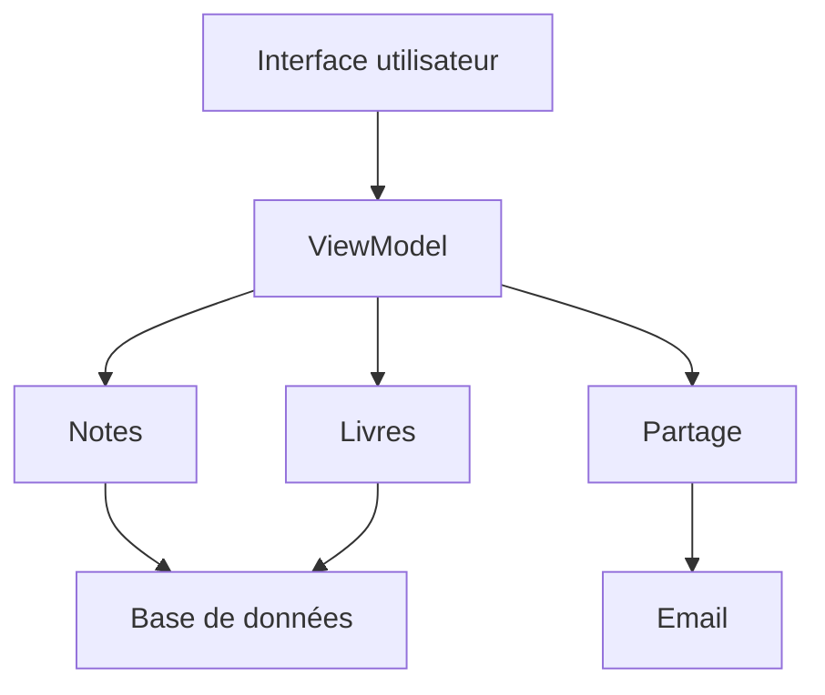

# Critères d'évaluation

- Les modules proposés offrent chacun une abstraction claire

- Le système est composé de modules groupés en couches par niveau d'abstraction et sans dépendances inutiles ou cycliques

# Solution proposée

Les modules les plus bas niveau sont la base de données, générique, et l'envoi d'e-mails.
Le module de livres et celui de notes utilisent la base de données, et la fonction de partage utilise l'e-mail.
Ensuite on peut par exemple avoir un ViewModel utilisant ces trois modules intermédiaires, et une interface utilisateur par-dessus :

