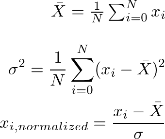

# Modularité

Considérez le problème de normaliser une liste de nombres (comme vous l'avez peut-être fait pour des statistiques)
en utilisant la formule suivante :

Les fonctions sont l'unité la plus basique de modularité, qui nous permettent d'exprimer des opérations comme
des boîtes noires qui prennent une entrée et la transforme en une sortie.
Cependant, si le corps d'une fonction devient trop long, il est difficile d'encapsuler son comportement dans un nom,
ce qui mène à des bugs venant de mécompréhensions quand elles sont utilisées par d'autres développeurs.

Regardez [src/main/java/App.java](src/main/java/App.java), et vous verrez que le développeur qui a écrit `compute()`
a inclut tout le programme dedans: l'I/O, le calcul, et la gestion des erreurs sont partout.
Votre tâche est de refactor `compute()` en plusieurs petites fonctions pour qu'on puisse la lire comme une recette,
c'est-à-dire une liste de tâches logiques; vous ne devez pas changer les signatures du code actuel.
