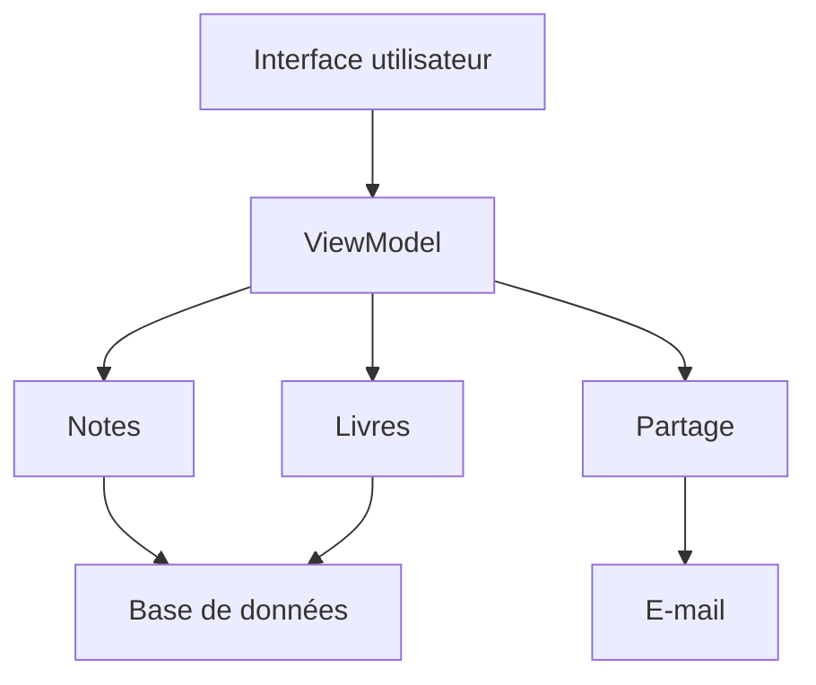

# Critères d'évaluation

- Les modules proposés fournissent chacun une abstraction claire

- Le système est composé de modules groupés en couches par niveau d'abstraction sans dépendances inutiles ou circulaires

# Solution suggérée

Les modules de plus bas niveau sont la base de données génériques et l'envoi d'e-mails.
Le module des livres et celui des notes utilisent la base de données, et le module de partage celui d'e-mails.
Il est ensuite possible d'avoir par exemple un ViewModel utilisant les trois modules intermédiaires, et une interface utilisateur par-dessus.

