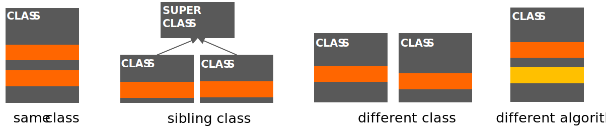

# Duplication

La duplication est un problème courant. Bien qu'il soit parfois difficile
de l'éviter complètement, il est important de la réduire au minimum. Le code dupliqué
se présente souvent sous plusieurs formes :

- Code dupliqué dans la même classe ou méthode
- Code dupliqué dans des classes apparentées
- Code dupliqué dans des classes différentes
- Différents algorithmes qui font la même chose

Voici une illustration des différentes formes de duplication :

Le code dupliqué est indiqué en orange foncé. Le code qui implémente la même fonctionnalité avec des algorithmes différents est indiqué en orange foncé.
fonctionnalité avec des algorithmes différents est indiqué en orange clair.

---

Dans cet exercice, vous allez remanier du code qui contient des duplications sous différentes formes.
différentes formes. Le projet a quatre packages : `one`, `two`, `three` et
`four`. Chaque package contient du code qui est dupliqué. Votre tâche est de
refactoriser le code de chaque package de manière à supprimer les doublons.

Pour chaque package, vous devez

1. Identifier la forme de duplication dans le package.
2. Refondre le code de manière à supprimer la duplication.
3. Indiquez le type de refactorisation que vous avez utilisé pour supprimer la duplication (par exemple, "Extraire une méthode", "Extraire une classe", etc.)
