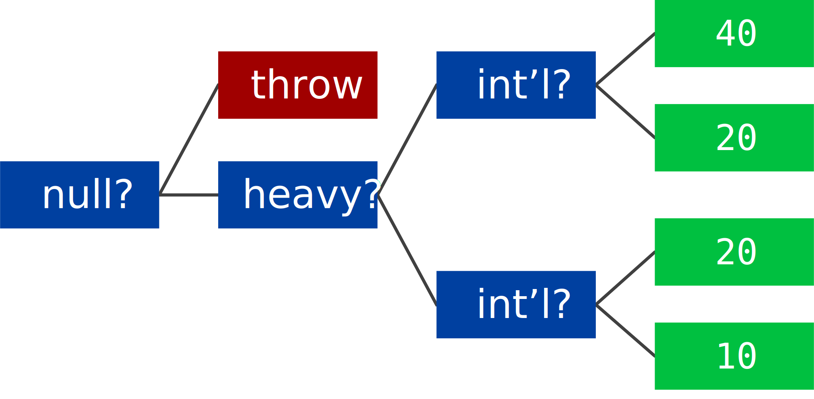
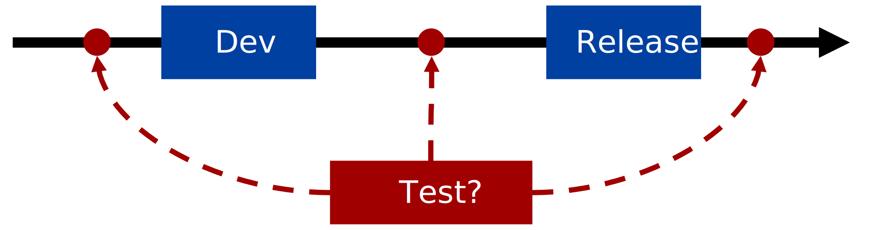

# Tests

**Prérequis** : Avant de suivre ce cours, assurez-vous que vous pouvez construire et exécuter le [projet d'exemple](exercices/projet-exemple).

Il est tentant de penser que les tests ne sont pas nécessaires si l'on écrit "simplement" du code correct dès le premier essai et si l'on relit son code avant de l'exécuter.

Mais dans la pratique, cela ne fonctionne pas. Les êtres humains commettent des erreurs en permanence.
Même [Ada Lovelace](https://en.wikipedia.org/wiki/Ada_Lovelace), qui a écrit un algorithme correct pour calculer les nombres de Bernoulli.
pour le "[Moteur analytique](https://en.wikipedia.org/wiki/Analytical_Engine)" de [Charles Babbage](https://en.wikipedia.org/wiki/Charles_Babbage),
a commis une faute de frappe en intervertissant deux variables dans la transcription du code de son algorithme.
Et elle a eu tout le temps de le vérifier, puisque le moteur analytique était une proposition de Babbage qui n'a pas été construite !
Le "tout premier programme" contenait déjà une coquille.

La vérification assistée par ordinateur est une option moderne, mais elle nécessite beaucoup de temps.
Si Ada Lovelace avait vécu au XXIe siècle, elle aurait pu écrire une preuve et demander à un ordinateur de la vérifier,
en s'assurant que la preuve est correcte tant que le programme de vérification est lui-même correct.
Cela peut fonctionner dans la pratique, mais actuellement au prix d'un effort important de la part des développeurs.
Le [noyau du système d'exploitation seL4](https://sel4.systems/), par exemple, a nécessité 200 000 lignes de preuve pour ses 10 000 lignes de code
(Klein et al., ["seL4 : formal verification of an OS kernel"](https://dl.acm.org/doi/10.1145/1629575.1629596)).
Une telle méthode aurait pu fonctionner pour Ada Lovelace, une aristocrate disposant de beaucoup de temps libre, mais elle n'est pas réaliste pour les programmeurs de tous les jours.

Une autre option moderne consiste à laisser les utilisateurs faire le travail, dans le cadre d'une version "bêta" ou d'un "accès anticipé".
Les utilisateurs ont la possibilité d'utiliser un programme avant tout le monde, au prix de rencontrer des bugs et de les signaler, ce qui fait d'eux des testeurs.
Cependant, cela ne fonctionne que si le programme est suffisamment intéressant, comme un jeu,
alors que la plupart des programmes existants sont conçus comme des outils internes pour un public restreint qui ne voudra probablement pas faire de bêta-tests.
En outre, elle n'élimine pas complètement les bugs. Le jeu "New World" d'Amazon, malgré une période de "bêta ouverte",
[publié](https://www.denofgeek.com/games/new-world-bugs-glitches-exploits-list-cyberpunk-2077/) avec de nombreux problèmes, notamment un délai de 7 jours avant de réapparaître en cas de mort.

Avons-nous vraiment besoin de tests ? Quelle est la pire conséquence d'un bug ?
Dans certains cas, le pire n'est pas si grave, comme par exemple un bug dans un jeu en ligne.
Mais imaginez un bug dans le système d'inscription aux cours d'une université, laissant les étudiants incertains de s'ils sont inscrits à un cours ou non.
Pire, un bug dans une banque peut faire apparaître ou disparaître de l'argent.
Pire encore, les bugs peuvent être mortels, comme dans le cas de la [machine de radiothérapie Therac-25](https://en.wikipedia.org/wiki/Therac-25) qui a tué certains patients.


## Objectifs

Après ce cours, vous devriez être en mesure de :

- Comprendre les bases des _tests automatisés_
- Évaluer les tests avec la _couverture du code_
- Identifier _quand_ écrire quels tests
- Adapter le code pour permettre des tests précis


## Qu'est-ce qu'un test ?

Les tests se déroulent essentiellement en trois étapes :

1. Mettre en place le système
2. Effectuer une action
3. Vérifier le résultat

Si le résultat est celui que nous attendons, nous sommes convaincus que le système fait ce qu'il faut dans ce cas.
Cependant, la "confiance" n'est pas une garantie.
Comme l'a dit [Edsger W. Dijkstra](https://en.wikipedia.org/wiki/Edsger_W._Dijkstra), "Les tests peuvent être utilisés pour démontrer la présence de bugs, mais jamais pour démontrer leur absence".

La manière la plus simple de tester est le test manuel.
Un humain exécute manuellement le processus ci-dessus.
Cela a l'avantage d'être facile, puisqu'il suffit d'effectuer les actions que l'on attendrait de toute façon des utilisateurs.
Elle permet également un certain degré de subjectivité : le résultat doit "avoir l'air correct", mais il n'est pas nécessaire de définir formellement ce que signifie "correct".

Cependant, les tests manuels présentent de nombreux inconvénients.
Ils sont lents : imaginez que vous exécutiez manuellement une centaine de tests.
Ils sont également sujets aux erreurs : à chaque essai, les chances qu'un être humain oublie d'exécuter une étape
exécute une étape incorrectement ou ne remarque pas que quelque chose ne va pas augmentent.
La subjectivité des tests manuels est aussi souvent un inconvénient : deux personnes peuvent ne pas être d'accord sur ce qui est "bon" ou "mauvais" pour un test donné.
Enfin, il est également difficile de tester les cas limites.
Imaginez que vous testiez qu'une application météo affiche correctement les chutes de neige lorsqu'elles se produisent alors qu'il fait actuellement beau chez vous.

Pour éviter les problèmes liés aux tests manuels, nous nous concentrerons sur les tests automatisés.
Le workflow fondamentalement le même, mais il est automatisé :

1. Le code met en place le système
2. Le code effectue une action
3. Le code vérifie le résultat

Ces étapes sont souvent appelées "arrange", "act", et "assert" en anglais.

Les tests automatisés peuvent être exécutés rapidement, car les ordinateurs sont beaucoup plus rapides que les humains et n'oublient pas les étapes et n'exécutent pas le code incorrectement.
Cela ne signifie pas que les tests automatisés sont toujours corrects : si le code décrivant le test est erroné, le résultat du test n'a pas de sens.
Les tests automatisés sont également plus objectifs : la personne qui rédige le test sait exactement ce qui sera testé.
Enfin, les tests automatisés permettent de tester les cas limites en simulant l'environnement du système testé, par exemple le serveur de prévisions météorologiques d'une application météo.

Les tests automatisés présentent également d'autres avantages : les tests peuvent être écrits une fois et utilisés pour toujours, partout, même sur des implémentations différentes.
Par exemple, la [spécification CommonMark](https://spec.commonmark.org/) pour les outils utilisant le format Markdown comprend de nombreux exemples utilisés comme tests,
ce qui permet à chacun d'utiliser ces tests pour vérifier son propre outil.
Si quelqu'un remarque un bug qui n'a pas été couvert par les tests standard, il peut suggérer un test qui couvre ce bug pour la prochaine version de la spécification.
Ce test peut ensuite être utilisé par tous les autres.
Le nombre de tests ne cesse de croître avec le temps et peut atteindre des quantités énormes, comme [la suite de tests SQLite](https://www.sqlite.org/testing.html),
qui compte actuellement plus de 90 millions de lignes de tests.

D'un autre côté, les tests automatisés sont plus difficiles que les tests manuels car il faut passer du temps à écrire le code de test, ce qui inclut une définition formelle du "bon" comportement.


## Comment écrire des tests automatisés ?

Nous utiliserons Java comme exemple, mais les tests automatisés fonctionnent de la même manière dans la plupart des langages.

L'idée principale est que chaque test est une méthode Java, et qu'un échec du test est indiqué par le fait que la méthode lance une exception.
Si la méthode ne génère pas d'exception, le test est réussi.

Une façon de le faire en utilisant les concepts intégrés de Java est la suivante :
```java
void test1plus1() {
  assert add(1, 1) == 2;
}
```
Si `add(1, 1)` retourne `2`, alors l'assertion ne fait rien, la méthode se termine, et le test est considéré comme réussi.
Mais s'il renvoie un autre nombre, l'assertion lève une `AssertionError`, qui est une sorte d'exception, et le test est considéré comme échoué.

...ou, du moins, c'est ainsi que cela devrait être, mais [les assertions Java sont désactivées par défaut](https://docs.oracle.com/javase/7/docs/technotes/guides/language/assert.html), malheureusement.
Cette méthode ne fait donc absolument rien, sauf si la personne qui exécute le test a explicitement activé les assertions.

On pourrait imiter la déclaration `assert` avec un `if` et un `throw` :
```java
void test1plus1() {
  if (add(1, 1) != 2) {
    throw new AssertionError();
  }
}
```
Il s'agit d'une implémentation pratique d'un test, que nous pourrions exécuter à partir d'une méthode `main`.
Cependant, si le test échoue, il n'y a pas de message d'erreur, puisque nous n'en avons pas mis lors de la création de `AssertionError`.
Par exemple, si le test échoue, qu'est-ce que `add(1, 1)` a réellement retourné ? Il serait bon de le savoir.
Nous pourrions écrire du code pour stocker le résultat dans une variable, tester cette variable, puis créer un message pour l'exception incluant cette variable.
Ou nous pouvons utiliser [JUnit](https://junit.org/junit5/) pour le faire à notre place :

```java
@Test
void test1plus1() {
  assertEquals(add(1, 1), 2);
}
```
JUnit trouve toutes les méthodes annotées avec `@Test` et les exécute, nous libérant ainsi de la nécessité d'écrire le code pour le faire nous-mêmes,
et lance des exceptions dont le message comprend la valeur "attendue" et la valeur "obtenue".

...attendez, avons-nous fait cela correctement ? Aurions-nous dû mettre la valeur "attendue" en premier ? Il est difficile de s'en souvenir.
Et même si nous faisons cette partie correctement, il est difficile de rendre les messages d'assertion utiles pour des tests tels que "cette liste doit être vide ou contenir `[1, 2, 3]`".
Nous pouvons écrire du code pour vérifier cela, mais si le test échoue, nous obtiendrons "`true` attendu, mais `false` obtenu", ce qui n'est pas utile.

Au lieu de cela, utilisons [Hamcrest](https://hamcrest.org/JavaHamcrest/) pour écrire nos assertions en plus de JUnit :
```java
@Test
void test1plus1() {
  assertThat(add(1, 1), is(2));
}
```
C'est beaucoup plus clair ! La partie `is` est un "matcher" Hamcrest, qui décrit la valeur attendue.
`is` est le plus simple, il correspond à une seule valeur, mais nous pouvons en utiliser de plus sophistiqués :
```java
List<Integer> values = ...;

assertThat(values,
    is(empty())
   .or(contains(1, 2, 3))
);
```

Si cette assertion échoue, le message d'exception de Hamcrest indique "Expected : (an empty collection or iterable containing `[<1>, <2>, <3>]`) but : was `<[42]>`".

Parfois, nous devons tester qu'un morceau de code "échoue" dans certaines circonstances, par exemple en validant correctement les arguments et en levant une exception si un argument a une valeur invalide.
C'est à cela que sert `assertThrows` :
```java
var ex = assertThrows(
  SomeException.class,
  () -> someOperation(42)
);

// ... tester 'ex'...    
```

Le premier argument est le type d'exception que nous attendons, le second est une fonction qui doit lever ce type d'exception.
Si la fonction ne lève pas d'exception, ou lève une exception d'un autre type, `assertThrows` lèvera une exception pour indiquer que le test a échoué.
Si la fonction lève une exception du bon type, `assertThrows` renvoie cette exception afin que nous puissions la tester plus si nécessaire, par exemple en affirmant un fait à propos de son message.

---
#### Exercice
C'est à vous de jouer ! Ouvrez [le projet d'exercice du cours](exercices/cours) et testez `Functions.java`.
Commencez par tester des valeurs valides pour `fibonacci`, puis testez qu'il rejette les valeurs invalides.
Pour `split` et `shuffle`, rappelez-vous que Hamcrest a beaucoup de matchers et a de la documentation.
<details>
<summary>Exemple de solution (cliquer pour développer)</summary>
<p>

Vous pouvez tester `fibonacci` en utilisant le matcheur `is` dont nous avons parlé plus tôt pour des nombres tels que 1 et 10,
et tester qu'il lève une exception pour les nombres inférieurs à `0` en utilisant `assertThrows`.

Pour tester `split`, vous pourriez utiliser le matcheur `contains` de Hamcrest, et pour la fonction de mélange, vous pourriez utiliser `arrayContainingInAnyOrder`.

Nous fournissons quelques [exemples](exercices/solutions/cours/FunctionsTests.java).

</p>
</details>

---

**Faut-il tester beaucoup de choses avec une seule méthode ou avoir plusieurs petites méthodes de test ?**
Pensez à ce à quoi ressembleront les résultats des tests si vous combinez plusieurs tests dans une seule méthode.
Si la méthode de test échoue, vous n'obtiendrez qu'un message d'exception concernant le premier échec de la méthode, et vous ne saurez pas si le reste de la méthode de test réussira.
Le fait d'avoir de grandes méthodes de test signifie également que la fraction de tests réussis est moins représentative de l'exactitude globale du code.
À l'extrême, si vous écrivez toutes les assertions dans une seule méthode, un seul bug dans votre code entraînerait 0 % de réussite des tests.
Vous devriez donc préférer les petites méthodes de test qui testent chacune un concept "logique", qui peut nécessiter une ou plusieurs assertions.
Cela ne signifie pas qu'il faille copier-coller de gros blocs de code entre les tests ;
il faut plutôt partager le code en utilisant des fonctions telles que les annotations `@BeforeAll`, `@AfterAll`, `@BeforeEach` et `@AfterEach` de JUnit.

**Comment tester les méthodes privées ?**
On ne teste _jamais_ les méthodes privées !
Sinon, les tests doivent être réécrits à chaque fois que l'implémentation change.
Revenons à l'exemple de SQLite : le code serait impossible à modifier si un changement dans les détails de l'implémentation
nécessitait de modifier ne serait-ce qu'une fraction des 90 millions de lignes de tests.

**Quelles sont les normes à respecter pour le code de test ?**
Les mêmes que pour le reste du code.
Le code de test doit se trouver dans le même dépôt de gestion de version que le reste du code, et doit être examiné au même titre que le reste du code lorsque des modifications sont apportées.
Cela signifie également que les tests doivent avoir des noms appropriés, pas `test1` ou `testFeatureWorks`
mais des noms spécifiques qui donnent des informations dans une vue d'ensemble des tests tels que `nameCanIncludeThaiCharacters`.
Évitez les noms qui utilisent des descriptions vagues telles que "correctement", "fonctionne" ou "valide".


## Quelle mesure peut-on utiliser pour évaluer les tests ?

Qu'est-ce qui fait un bon test ?
Lors de l'examen d'une modification de code, comment savoir si les tests existants sont suffisants ou s'il faut en ajouter ou en réduire le nombre ?
Lors de l'examen d'un test, comment savoir s'il est utile ?

Il existe de nombreuses façons d'évaluer les tests ; nous nous concentrerons ici sur la plus courante, la _couverture_ ("coverage" en anglais).
La couverture des tests est définie comme la fraction de code exécutée par les tests par rapport à la quantité totale de code.
Sans tests, elle est de 0%. Avec des tests qui exécutent chaque partie du code au moins une fois, elle est de 100 %.
Mais qu'est-ce qu'une "partie du code" ? Quelle devrait être la mesure exacte de la couverture ?

Une façon naïve de le faire est la couverture de _lignes_. Prenons l'exemple suivant :
```java
int getFee(Package pkg) {
  if (pkg == null) throw ...;
  int fee = 10;
  if (pkg.isHeavy()) fee += 10;
  if (pkg.isInternational()) fee *= 2;
  return fee;
}
```

Un seul test avec un paquet non nul qui est à la fois lourd et international couvrira toutes les lignes.
Cela peut sembler une bonne chose puisque la couverture est à 100 % et facile à obtenir, mais ce n'est pas le cas.
Si le `throw` était sur une ligne différente au lieu d'être sur la même ligne que le `if`, la couverture de la ligne ne serait plus de 100%.
Il n'est pas judicieux de définir une mesure de couverture qui dépende du formatage du code.

Au lieu de cela, la mesure la plus simple pour la couverture des tests est la couverture des _instructions_.
Dans notre exemple, l'instruction `throw` n'est pas couverte mais toutes les autres le sont, et cela ne change pas en fonction du formatage du code.
Il n'en reste pas moins que le fait d'atteindre une couverture de près de 100 % sur la base d'un seul test pour le code ci-dessus semble erroné.
Il y a trois instructions "if", indiquant que le code effectue différentes actions en fonction d'une condition, mais nous avons ignoré les blocs "else" implicites dans ces "ifs".

Une forme plus avancée de couverture est la couverture de _branches_ : la fraction des choix de branche qui sont couverts.
Pour chaque branche, telle qu'une instruction "if", une couverture à 100 % de la branche implique de couvrir les deux choix.
Dans le code ci-dessus, la couverture de branche pour notre seul exemple de test est de 50% : nous avons couvert exactement la moitié des choix.

Il est possible d'atteindre 100 % en effectuant deux tests supplémentaires : un colis nul et un colis qui n'est ni lourd ni international.

Mais prenons un peu de recul et réfléchissons à ce que notre exemple de code peut faire :

<p align="center"></p>

Le code comporte cinq chemins, dont un qui échoue.
Pourtant, avec la couverture des branches, nous pourrions crier victoire après seulement trois tests, laissant deux chemins inexplorés.
C'est là qu'intervient la couverture des _chemins_. La couverture des chemins est la forme la plus avancée de la couverture, qui compte la fraction des chemins exécutés dans le code.
Nos trois tests couvrent 60% des chemins, soit 3 sur 5. Nous pouvons atteindre 100 % en ajoutant des tests pour les deux chemins non couverts : un paquet lourd mais non international et l'inverse.

La couverture des chemins semble très intéressante en théorie.
Mais dans la pratique, cette solution est souvent irréalisable, comme le montre l'exemple suivant :

```java
while (true) {
  var input = getUserInput();
  if (input.length() <= 10) break;
  tellUser("Pas plus de 10 caractères");
}
```

La couverture maximale des chemins que l'on peut obtenir pour ce code est _zéro_.
En effet, il existe un nombre infini de chemins : la boucle peut s'exécuter une fois, ou deux fois, ou trois fois, et ainsi de suite.
Comme on ne peut écrire qu'un nombre fini de tests, la couverture des chemins est bloquée à 0%.

Même en l'absence de boucles infinies, la couverture des chemins est difficile à obtenir dans la pratique.
Avec seulement 5 instructions `if` indépendantes, on doit écrire 32 tests.
Si 10% des lignes de code sont des instructions "if", un programme de 5 millions de lignes comporte plus de chemins qu'il n'y a d'atomes dans l'univers.
Et 5 millions de lignes, c'est bien moins que ce que certains programmes ont en pratique, comme les navigateurs Web.

Il y a donc un compromis entre la faisabilité et la confiance dans la couverture.
La couverture des instructions est généralement facile à obtenir mais ne donne pas beaucoup de confiance,
alors que la couverture des chemins peut être impossible à obtenir dans la pratique mais donne beaucoup de confiance.
La couverture des branches est une solution intermédiaire.

Il est important de noter que la couverture n'est pas tout.
Nous pourrions couvrir 100 % des chemins de notre fonction `getFee` ci-dessus avec 5 tests, mais si ces 5 tests ne vérifient pas réellement la valeur renvoyée par la fonction, ils ne sont pas utiles.
La couverture est une mesure qui devrait vous aider à décider si des tests supplémentaires seraient utiles, mais elle ne remplace pas l'examen humain.

---
#### Exercice
Exécutez vos tests de l'exercice précédent avec la couverture.
Vous pouvez le faire soit à partir de la ligne de commande, soit à partir de votre IDE préféré, qui devrait avoir une commande "exécuter les tests avec couverture" à côté de "exécuter les tests".
Notez que l'utilisation de la ligne de commande lancera l'outil [JaCoCo](https://www.jacoco.org/jacoco/), qui est un moyen courant d'obtenir la couverture du code en Java.
Si vous utilisez un IDE, vous pouvez utiliser son propre outil de couverture de code, qui peut présenter des différences mineures de couverture par rapport à JaCoCo dans certains cas.


## Quand tester ?

Jusqu'à présent, nous avons supposé que les tests étaient écrits après le développement, avant que le code ne soit publié.
C'est pratique, car le code testé existe déjà.
Mais elle présente le risque de reproduire les erreurs trouvées dans le code : si un ingénieur n'a pas pensé à un cas limite lors de l'écriture du code,
il est peu probable qu'il y pense en écrivant les tests immédiatement après.
Il est également trop tard pour corriger la conception : si un cas de test révèle que le code ne fonctionne pas parce que sa conception nécessite des modifications fondamentales,
cela devra probablement être fait rapidement sous pression, ce qui conduira à une conception sous-optimale.

Si nous simplifions le cycle de vie d'un produit en le réduisant à son développement et à sa mise sur le marché, il y a trois moments où nous pouvons effectuer des tests :

<p align="center"></p>

Celui du milieu est celui que nous avons déjà vu. Les deux autres peuvent sembler étranges à première vue, mais ils ont de bonnes raisons d'exister.

Les tests avant le développement sont communément appelés **développement piloté par les tests**, "test-driven development" en anglais ou _TDD_ en abrégé,
parce que les tests "pilotent" le développement, en particulier la conception du code.
Dans la méthode TDD, on écrit d'abord les tests, puis le code.
Après avoir écrit le code, on peut exécuter les tests et corriger les bugs.
Cela oblige les programmeurs à réfléchir avant de coder, au lieu d'écrire la première chose qui leur vient à l'esprit.
Il fournit un retour d'information instantané pendant l'écriture du code, ce qui peut être très gratifiant : écrivez une partie du code, exécutez les tests, et certains tests réussissent maintenant !
Cela donne une sorte d'indication de l'état d'avancement. Il n'est pas non plus trop tard pour corriger la conception, puisque celle-ci n'existe pas encore.

Le principal inconvénient du TDD est qu'il nécessite un investissement en temps plus important et qu'il peut même conduire à des dépassements de délais.
En effet, le code testé doit être écrit indépendamment des tests écrits.
Si l'on passe trop de temps à écrire des tests, il ne restera plus assez de temps pour écrire le code.
Lorsque les tests sont effectués après le développement, ce n'est pas un problème car il est toujours possible d'arrêter d'écrire des tests à tout moment, puisque le code existe déjà,
au prix d'un nombre réduit de tests et donc d'une confiance moindre dans le code.
Un autre inconvénient du TDD est que la conception doit être connue à l'avance,
ce qui est bien pour développer un module en fonction des exigences du client, mais pas pour prototyper, par exemple, un code de recherche.
Il ne sert à rien d'écrire une suite de tests complète pour un programme si l'objectif même de ce programme change le lendemain après réflexion.

Voyons maintenant un exemple de TDD étape par étape.
Vous êtes ingénieur logiciel et vous développez une application pour une banque.
Votre première tâche consiste à mettre en œuvre le retrait d'argent d'un compte.
La banque vous dit que "les utilisateurs peuvent retirer de l'argent de leur compte bancaire".
Il vous reste donc une question à poser à la banque : "Un compte bancaire peut-il avoir un solde inférieur à zéro ?".
La banque répond "non", ce n'est pas possible.

Vous commencez par écrire un test :
```java
@Test void canWithdrawNothing() {
  var account = new Account(100);
  assertThat(account.withdraw(0), is(0));
}
```
Le constructeur `new Account` et la méthode `withdraw` n'existent pas, vous créez donc un code "squelette" qui est juste suffisant pour que les tests _compilent_, mais pas encore pour qu'ils passent :
```java
class Account {
  Account(int balance) { }
  int withdraw(int amount) { throw new UnsupportedOperationException("TODO"); }
}
```
Vous pouvez maintenant ajouter un autre test pour la question "solde inférieur à zéro" que vous aviez :
```java
@Test void noInitWithBalanceBelow0() {
  assertThrows(IllegalArgumentException.class, () -> new Account(-1));
}
```
Ce test ne nécessite pas d'autres méthodes dans `Account`, donc vous continuez avec un autre test :
```java
@Test void canWithdrawLessThanBalance() {
  var account = new Account(100);
  assertThat(account.withdraw(10), is(10));
  assertThat(account.balance(), is(90));
}
```
Cette fois, vous devez ajouter une méthode `balance` à `Account`, avec le même contenu temporaire que `withdraw`. Encore une fois, le but est de faire compiler les tests, pas de les faire passer.
Vous ajoutez ensuite un dernier test pour les retraits partiels :
```java
@Test void partialWithdrawIfLowBalance() {
  var account = new Account(10);
  assertThat(account.withdraw(20), is(10));
  assertThat(account.balance(), is(0));
}
```
Vous pouvez maintenant exécuter les tests... et constater qu'ils échouent tous ! C'est normal, puisque vous n'avez rien implémenté.
Vous pouvez maintenant implémenter `Account` et exécuter les tests à chaque fois que vous faites un changement jusqu'à ce qu'ils passent tous.

Enfin, vous retournez voir votre client, la banque, et lui demandez ce qu'il y a lieu de faire.
Il vous donne une autre exigence qu'il avait oublié : la banque peut bloquer des comptes et le retrait d'un compte bloqué n'a pas d'effet.
Vous pouvez maintenant traduire cette exigence en tests, en ajoutant du code si nécessaire pour que les tests se compilent, puis en implémentant le code.
Une fois que vous aurez terminé, vous reviendrez vers le client, et ainsi de suite jusqu'à ce que votre demande réponde à toutes les exigences.

----
#### Exercice
A vous de jouer ! Dans [le projet d'exercices du cours](exercices/cours) vous trouverez `PeopleCounter.java`, qui est documenté mais non implémenté.
Écrivez d'abord des tests, puis implémentez le code et corrigez votre code s'il ne passe pas les tests, à la manière TDD.
Il faut d'abord réfléchir aux tests à écrire, puis les écrire et enfin implémenter le code.

<details>
<summary>Exemple de tests (cliquer pour développer)</summary>
<p>

Vous pourriez avoir cinq tests : le compteur s'initialise à zéro, la méthode "increment" incrémente le compteur,
la méthode "reset" met le compteur à zéro, la méthode "increment" n'incrémente pas au-delà du maximum,
et le maximum ne peut être inférieur à zéro.

Nous fournissons [des exemples de tests](exercices/solutions/cours/PeopleCounterTests.java) et [une implémentation de référence](exercices/solutions/cours/PeopleCounter.java).

</p>
</details>

----

Les tests effectués _après_ le déploiement sont communément appelés **tests de régression**. L'objectif est de s'assurer que les anciens bugs ne réapparaissent pas.

Lorsqu'on est confronté à un bug, l'idée est d'abord d'écrire un test défaillant qui reproduit le bug,
puis de corriger le bug, et enfin d'exécuter à nouveau le test pour montrer que le bug est corrigé.
Il est essentiel d'exécuter le test avant de corriger le bug afin de s'assurer qu'il échoue réellement.
Dans le cas contraire, le test pourrait ne pas reproduire le bug et ne passerait après la "correction" du bug que parce qu'il passait déjà avant, ne fournissant ainsi aucune information utile.

Rappelons l'exemple de SQLite : toutes ces 90 millions de lignes de code montrent qu'une très longue liste de bugs possibles n'apparaîtra plus dans aucune version future.
Cela ne signifie pas qu'il n'y a plus de bugs, mais que la plupart des bugs courants ont été supprimés, et que les autres sont très probablement des cas de figure inhabituels que personne n'a encore rencontrés.


## Comment peut-on tester des modules entiers ?

Jusqu'à présent, nous avons vu des tests pour des fonctions pures, qui ne dépendent pas d'autres code.
Il est utile de les tester pour s'assurer de leur exactitude, mais tous les programmes ne sont pas des fonctions pures.

Considérons la fonction suivante :

```java
/** Télécharge le livre avec l'ID donné
 * et l'imprime sur la console. */
void printBook(String bookId);
```

Comment pouvons-nous tester cela ? Tout d'abord, la fonction renvoie `void`, c'est-à-dire rien, alors que pouvons-nous tester ?
La documentation mentionne également le téléchargement de données, mais d'où vient cette fonctionnalité ?

Nous pourrions tester cette fonction en lui transmettant un numéro d'identification de livre que nous savons valide et en vérifiant le résultat.
Cependant, ce livre pourrait un jour être retiré ou son contenu mis à jour, ce qui invaliderait notre test.

En outre, les tests qui dépendent de l'environnement, comme le dépôt de livres utilisé par cette fonction, ne peuvent pas facilement tester les cas limites.
Comment tester ce qui se passe si le contenu du livre est malformé ?
Ou si la connexion Internet est interrompue après le téléchargement de la table des matières mais avant le téléchargement du premier chapitre ?

On pourrait concevoir des tests _de bout en bout_ pour cette fonction : exécuter la fonction dans un environnement personnalisé,
tel qu'une machine virtuelle dont les demandes de réseau sont interceptées,
et analyser sa sortie à partir de la console, ou éventuellement la rediriger vers un fichier.
Si les tests de bout en bout sont utiles, ils nécessitent beaucoup de temps et d'efforts, et constituent une infrastructure qui doit être maintenue.

Au lieu de cela, attaquons-nous à la cause première du problème : l'entrée et la sortie de `printBook` sont _implicites_, alors qu'elles devraient être _explicites_.

Rendons d'abord l'entrée explicite en concevant une interface pour les requêtes HTTP :

```java
interface HttpClient {
  String get(String url);
}
```

Nous pouvons alors donner un `HttpClient` comme paramètre à `printBook`, qui l'utilisera au lieu de faire des requêtes HTTP lui-même.
Cela rend l'entrée explicite, et permet également au code `printBook` de se concentrer sur la tâche qu'il est censé accomplir plutôt que sur les détails des requêtes HTTP.

Notre fonction `printBook` avec une entrée explicite ressemble donc à ceci :
```java
void printBook(
  String bookId,
  HttpClient client
);
```

Ce processus consistant à rendre les dépendances explicites et à les transmettre en tant qu'entrées est appelé **injection de dépendances**.

Nous pouvons ensuite le tester avec toutes les réponses HTTP que nous voulons, y compris les exceptions, en créant un faux client HTTP pour les tests :

```java
var fakeClient = new HttpClient() {
  @Override
  public String get(String url) { ... }
}
```

Pendant ce temps, dans le code de production, nous implémenterons les requêtes HTTP dans une classe `RealHttpClient` afin que nous puissions appeler `printBook(id, new RealHttpClient(...))`.

Nous pourrions rendre la sortie explicite de la même manière, en créant une interface `ConsolePrinter` que nous passerions en argument à `printBook`.
Cependant, nous pouvons modifier la méthode pour qu'elle renvoie le texte à la place, ce qui est souvent plus simple :

```java
String getBook(
  String bookId,
  HttpClient client
);
```

Nous pouvons maintenant tester le résultat de `getBook`, et dans le code de production l'envoyer à `System.out.println`.

Adapter le code en injectant des dépendances et en rendant les sorties explicites nous permet de tester davantage de code avec des tests "simples" plutôt qu'avec des tests complexes de bout en bout.
Si les tests de bout en bout restent utiles pour s'assurer que les dépendances sont respectées et que les résultats sont utilisés correctement,
les tests manuels pour les scénarios de bout en bout fournissent déjà un degré raisonnable de confiance. Par exemple, si le code n'imprime pas du tout sur la console, un humain le remarquera certainement.

Ce type de modifications du code peut être effectué de manière récursive jusqu'à ce que seul le "code de collage" entre les modules et les primitives de bas niveau restent non testables.
Par exemple, une classe "client UDP" peut prendre en paramètre une interface "client IP", de sorte que la fonctionnalité UDP puisse être testée.
La mise en œuvre de l'interface "client IP" peut elle-même prendre en paramètre une interface "client de données", de sorte que la fonctionnalité IP puisse être testée.
Les implémentations de l'interface "client de données", comme Ethernet ou Wi-Fi, devront probablement être testées de bout en bout puisqu'elles ne dépendent pas elles-mêmes d'autres logiciels locaux.

---
#### Exercice
A vous de jouer ! Dans [le projet d'exercices du cours](exercices/cours) vous trouverez `JokeFetcher.java`, qui n'est pas facile à tester dans son état actuel.
Modifiez-le pour le rendre testable, écrivez des tests et modifiez `App.java` pour qu'il corresponde aux changements de `JokeFetcher` et préserve la fonctionnalité du programme original.
Commencez par écrire une interface pour un client HTTP, implémentez-la en déplaçant le code existant, et utilisez-la dans `JokeFetcher`. Ensuite, ajoutez des tests.

<details>
<summary>Suggestions (cliquez pour développer)</summary>
<p>

Les changements nécessaires sont similaires à ceux que nous avons discutés plus haut, y compris l'injection d'une dépendance `HttpClient` et le fait que la fonction retourne une `String`.
Nous fournissons [un exemple de `JokeFetcher`](exercices/solutions/cours/JokeFetcher.java), [un exemple d'`App`](exercices/solutions/cours/App.java),
et [des tests](exercices/solutions/cours/JokeFetcherTests.java).

</p>
</details>

----

Si vous avez besoin d'écrire beaucoup de dépendances de test différentes, vous pouvez trouver utiles les frameworks de _mocking_ tels que [Mockito](https://site.mockito.org/) pour Java.
Ces frameworks vous permettent d'écrire un faux `HttpClient`, par exemple, comme ceci :

```java
var client = mock(HttpClient.class);
when(client.get(anyString())).thenReturn("Hello");
// il existe également des méthodes permettant de lever une exception, de vérifier que des appels spécifiques ont été effectués, etc.
```

Il existe d'autres types de tests dont nous n'avons pas parlé dans ce cours, tels que les tests de performance, les tests d'accessibilité, les tests d'utilisabilité, etc.
Nous verrons certains d'entre eux dans les cours suivants.


## Résumé

Dans ce cours, vous avez appris :
- Les tests automatisés, leurs fondements, quelques bonnes pratiques, et comment adapter le code pour le rendre testable
- La couverture du code comme moyen d'évaluer les tests, y compris la couverture des instructions, la couverture des branches et la couverture des chemins.
- Quand écrire des tests, y compris les tests après le développement, le TDD et les tests de régression

Vous pouvez maintenant consulter les [exercices](exercices/) !
